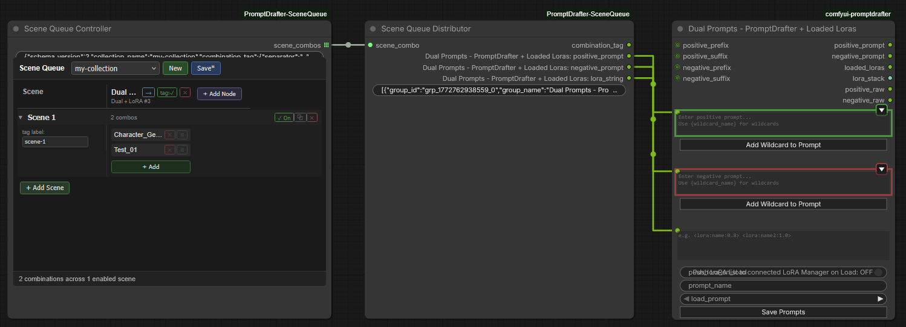

# ComfyUI-PromptDrafter-SceneQueue


A companion pack for [ComfyUI-PromptDrafter](https://github.com/Carasibana/ComfyUI-PromptDrafter) that adds scene-based batch generation to ComfyUI.

Set up named scenes, assign PromptDrafter presets to each node slot per scene, and run the workflow once — every combination renders automatically, producing one image per combination.

---

## Requirements

- [ComfyUI-PromptDrafter](https://github.com/Carasibana/ComfyUI-PromptDrafter) must be installed

---

## How It Works

### Two Nodes

**Scene Queue Controller**

The Controller holds the editor UI where you set up your collection of scenes and presets. When the workflow runs it reads the active collection file, builds the full list of every combination defined across all enabled scenes, and outputs them as a list using ComfyUI's native `OUTPUT_IS_LIST` mechanism — so ComfyUI iterates the entire downstream subgraph once per combination automatically. No re-queuing, no external scheduler.

**Scene Queue Distributor**

The Distributor is automatically created and wired to the Controller when you place a Controller node. It receives one combination object per iteration. For each group (PromptDrafter node) in that combination it reads the assigned preset file and outputs the prompt text directly to the matching PromptDrafter node's text input fields (`positive_prompt`, `negative_prompt`, `lora_string`, or `prompt` depending on node type). Wires from the Distributor to your PromptDrafter nodes are created automatically when you add nodes via the Controller's editor UI.

### Example Workflow



### Data Flow

```
[Scene Queue Controller]
  └── SCENE_COMBO list (OUTPUT_IS_LIST) ──► [Scene Queue Distributor]
                                                ├── combination_tag ──► [SaveImage prefix]
                                                ├── Expression: positive_prompt ──► [Expression PromptDrafter]
                                                ├── Expression: negative_prompt ──► [Expression PromptDrafter]
                                                ├── Pose: positive_prompt ──► [Pose PromptDrafter]
                                                └── Pose: negative_prompt ──► [Pose PromptDrafter]

[PromptDrafter nodes] ──► [CLIPTextEncode] ──► [KSampler] ──► [SaveImage]
```

---

## Setting Up a Collection

1. Place a **Scene Queue Controller** node — a **Scene Queue Distributor** is automatically created and connected to it.

2. In the Controller's editor, click **New** to create a collection and give it a name.

3. Click **+ Add Node** to add a PromptDrafter node as a column. The Distributor's output slots update automatically and wires are drawn to the PromptDrafter node.

4. Click **+ Add Scene** to create a scene row.

5. Expand a scene row and click **+ Add** in each column to assign presets from your PromptDrafter library.

6. Click **Save** to save the collection.

7. Wire the Distributor's **combination_tag** output to your SaveImage node's `filename_prefix` input.

8. Press **Queue** — one image per combination is generated in that single run.

### Combinations

Each enabled scene produces combinations equal to the product of the number of presets assigned per column. For example, a scene with 3 Expressions × 2 Poses × 2 Styles = 12 combinations from that scene alone. All enabled scenes are summed into a single run.

The **combination_tag** is a `_`-separated string built from the scene label and each group's preset label (or a truncated preset name), useful as a SaveImage filename prefix to identify each output.

---

## PromptDrafter Node Types Supported

| Node Type | Fields output per group |
|---|---|
| `Dual_PromptDrafter` | `positive_prompt`, `negative_prompt` |
| `DualLora_PromptDrafter` | `positive_prompt`, `negative_prompt`, `lora_string` |
| `Single_PromptDrafter` | `prompt` |

LoRA handling uses `DualLora_PromptDrafter`'s `lora_string` input → `_parse_lora_string_to_stack()` → `LORA_STACK` output → LoRA Loader node. Wire your workflow accordingly.

---

## Workflow Design Notes

This pack requires a different workflow layout from a standard single-image setup:

- PromptDrafter nodes receive their text from the Distributor (wired inputs), not from their widgets
- LoRA nodes should receive their LoRA stack from `DualLora_PromptDrafter`'s `lora_stack` output rather than being driven by an upstream LoRA Manager widget
- The `push_lora_on_load` upstream sync feature of PromptDrafter is not used in this context — presets drive everything

---

## Changelog

### v1.0.1
- Fixed raw widget text (`sq_collection_data` JSON) being partially visible above the Scene Queue editor UI
- Fixed blank space at the bottom of the Scene Queue Controller node — the editor UI now fills the full node height and can be freely resized larger or smaller
- Added **Disconnect Outputs** and **Reconnect Outputs** buttons to the Distributor node — allows temporarily disconnecting all output wires so PromptDrafter node text fields can be edited manually, then reconnecting in one click
- Replaced all browser `alert()`, `confirm()`, and `prompt()` calls with ComfyUI-native toast notifications and dialogs — fixes silent failures in ComfyUI Desktop (Electron) and browsers with popup blockers

### v1.0.0
- **Public release**: Initial stable version
- **Architecture rewrite**: replaced the re-queue loop with native `OUTPUT_IS_LIST` batch generation — all combinations now render in a single workflow run
- Added **Scene Queue Distributor** node — auto-created and connected when Controller is placed; outputs preset text fields directly to PromptDrafter nodes
- Distributor output slots are dynamic: slots are added/removed and wires are drawn automatically when nodes are added or removed via the Controller editor
- Slot 0 on the Distributor is always `combination_tag` and is never affected by group changes
- Removed `combination_index` widget and all re-queue / `send_sync` / `scenequeue.advance` logic
- Removed progress bar widget (no longer applicable to single-run batch model)

### v0.0.2
- Editor UI: scene rows, group columns, preset cells, collection picker, save/load
- Pre-flight validation of preset file paths before running
- `combination_tag` output with configurable separator and per-preset tag labels
- Scan graph / Add Node picker to find PromptDrafter nodes in the workflow
- Retarget and remove group columns
- Enable/disable individual scenes
- Re-queue loop mechanism (replaced in v0.0.3)

### v0.0.1
- Initial proof-of-concept: single SceneQueueController node, basic scene/group/preset data model, re-queue via `send_sync`
